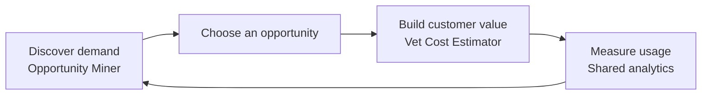

# Pet Growth Platform

A growth-engineering portfolio project that combines two distinct pet products in one Cloudflare application:

1. **Pet Content Opportunity Miner** — an internal research workflow for finding and evaluating pet-search opportunities.
2. **Australian Pet Vet Cost Estimator** — a customer-facing utility built around a practical pet-owner need.

**[Explore the live Pet Growth Platform](https://pet-content-opportunity-miner.jasonleonard46.workers.dev/)**

---

## Why these projects live together

The products serve different users, but demonstrate two sides of the same growth loop:



The miner shows how a growth team can move from search signals to a structured content decision. The estimator shows how a validated need can become a useful public experience. Shared analytics then provides feedback for the next iteration.

## The two products

| Product | Audience | Purpose | Open it |
| --- | --- | --- | --- |
| **Pet Content Opportunity Miner** | Growth, SEO, and content teams | Research keywords, evaluate landing-page potential, and generate production-ready briefs | [Research workspace](https://pet-content-opportunity-miner.jasonleonard46.workers.dev/research.html) |
| **Australian Pet Vet Cost Estimator** | Australian dog and cat owners | Produce an indicative cost range for common veterinary visits using published price anchors | [Vet cost estimator](https://pet-content-opportunity-miner.jasonleonard46.workers.dev/tools/vet-cost/) |

### 1. Pet Content Opportunity Miner

The research workspace turns a pet-related keyword into an actionable opportunity analysis.

- Collects live Google autocomplete signals
- Generates realistic customer questions with OpenAI
- Scores commercial intent, search intent, page fit, and content depth
- Recommends what to build—or when not to build
- Produces landing-page ideas, FAQs, and a structured page brief
- Runs automated output QA
- Supports single-keyword and batch analysis
- Saves recent analyses in the browser
- Exports individual or complete history as JSON and batch results as CSV

### 2. Australian Pet Vet Cost Estimator

The estimator helps pet owners form a planning range before a common veterinary visit.

- Supports dogs and cats, age groups, Australian states, and area types
- Covers common appointment categories
- Calculates prices deterministically rather than asking AI to invent a price
- Uses published Australian provider prices as source anchors
- Shows its methodology, assumptions, sources, and data review date
- Validates inputs and caches repeated estimates in Cloudflare KV for seven days

> Estimates are for planning only. They are not clinic quotes, diagnoses, or medical advice.

## Shared platform features

### Privacy-conscious analytics

The [analytics dashboard](https://pet-content-opportunity-miner.jasonleonard46.workers.dev/analytics.html) measures use across both products and requires an admin token.

It stores only an allow-listed set of aggregate product events with an anonymous browser session ID. Raw keywords, names, email addresses, and other personal information are not collected. Events expire after 90 days.

### Application routes

| Route | Experience |
| --- | --- |
| `/` | Platform homepage and project selector |
| `/research.html` | Single-keyword opportunity miner |
| `/batch.html` | Batch keyword workflow |
| `/tools/vet-cost/` | Australian vet cost estimator |
| `/analytics.html` | Shared usage dashboard |

### Worker API

| Method | Endpoint | Responsibility |
| --- | --- | --- |
| `GET` | `/api/autocomplete` | Retrieve autocomplete signals |
| `POST` | `/api/questions` | Generate customer-style questions |
| `POST` | `/api/mine` | Create and score an opportunity analysis |
| `POST` | `/api/estimate` | Calculate a source-backed vet cost range |
| `POST` | `/api/events` | Record an allow-listed anonymous event |
| `GET` | `/api/analytics` | Return aggregate platform metrics |

## Technology

- Cloudflare Workers and static assets
- Cloudflare KV for estimate caching and expiring analytics events
- OpenAI API for question generation and opportunity analysis
- Vanilla HTML, CSS, and JavaScript
- Node.js smoke and unit tests
- GitHub Actions verification on pushes and pull requests

## Run locally

Requirements:

- Node.js 20 or newer
- A Cloudflare account
- An OpenAI API key

```bash
npm install
npx wrangler secret put OPENAI_API_KEY
npx wrangler secret put ANALYTICS_ADMIN_TOKEN
npm run dev
```

Open the local URL printed by Wrangler.

The existing `wrangler.jsonc` contains the deployed KV binding. If you fork the project into another Cloudflare account, create your own KV namespace and replace its IDs before deploying.

Optional Cloudflare Turnstile protection can be enabled by setting `TURNSTILE_SITE_KEY` as a runtime variable and `TURNSTILE_SECRET_KEY` as a secret. The public APIs retain per-client minute and daily limits even when Turnstile is not configured.

## Quality checks

```bash
npm run check
```

This runs route, asset, local-link, API, repository-hygiene, and pricing/analytics logic checks.

## Deploy

```bash
npm run deploy
```

## Project history

The vet cost estimator began as the separate [`web5` prototype](https://github.com/jason1511/web5). It was consolidated here so the internal research workflow, customer utility, shared analytics, tests, and deployment could tell one complete growth-engineering story.

This repository is now the canonical home for both products.

## Author

**Jason Leonard**  
Bachelor of ICT (Software Technology)
